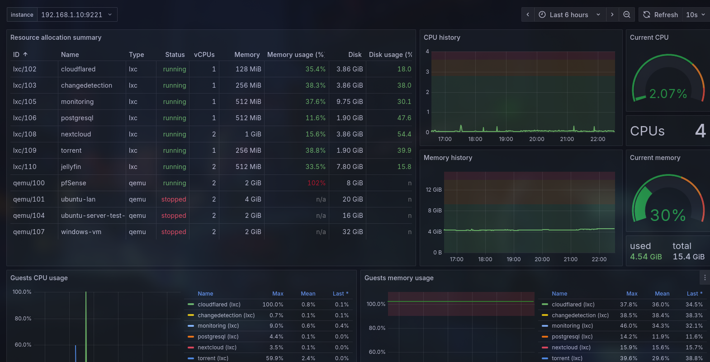

# 🏠 Complete Home Lab Setup Guide

This comprehensive guide will walk you through building a complete home lab infrastructure using Proxmox as the virtualization platform, pfSense for network security and routing, and Cloudflare tunnels for secure remote access.

## 📋 Table of Contents
- [Prerequisites and Planning](./prerequisites-and-planning.md)
- [Environment Preparation](./environment-preparation.md)
- [Proxmox Installation and Initial Setup](./proxmox-installation.md)
- [Proxmox Backup Guide](./proxmox-backup-guide.md)
- [PVE Bind-Mount Guide](./bind-mount.md)
- [Basic Security and SSH Configuration](./basic-security-and-ssh.md)
- [Network Architecture and pfSense Setup](./network-and-pfsense.md)
- [Remote Access with Cloudflare Tunnels](./remote-access-cloudflare.md)
- [Zero Trust Security Implementation](./zero-trust-security.md)
- [Securing Services with mTLS](./mTLS-cert.md)
- [Maintenance and Logging](./maintenance-and-logging.md)
- [Monitoring Your Home Lab](./monitoring.md)

## 🛠️ Services

Here are the services I am running in my home lab. Each service has its own installation guide.

- [ChangeDetection.io](./services/changedetection-io.md)
- [Nextcloud](./services/nextcloud.md)
- ~~[Transmission](./services/transmission.md)~~
- [qBittorrent](./services/qbittorrent.md)
- [Jellyfin](./services/jellyfin.md)
- [Stirling PDF](./services/stirlingpdf.md)

