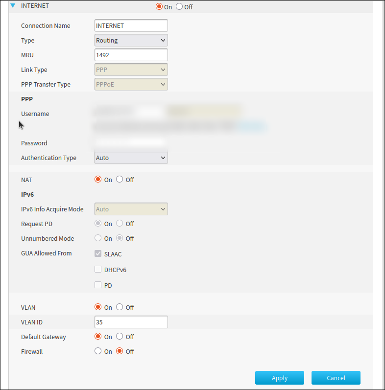

> [!Info]
> As can be seen in the screenshot out ISP uses VLAN between ONT and Router
## Topology 1: Dual Dedicated 1G Ports (The Hardware Method)

**How it works:** You physically add a second network card to the mini PC (using either the 3D-printed M.2 A+E adapter bracket or an official HP Flex IO module). One physical port handles the raw internet (WAN), and the other handles the local network (LAN). 
**Pros:** The absolute cleanest, lowest-latency setup. Zero hairpin bottlenecks. Traffic shaping algorithms like FQ-CoDel work flawlessly to kill bufferbloat. 
**Cons:** Requires opening the case, modifying hardware, or 3D printing custom parts.

### How to
#### 1. Nuke the Existing WAN Configuration

Before building the new chain, the physical port connected to your modem must be completely empty.
1. Go to **Interfaces** -> **[WAN]** (or whatever your physical port is named).
2. Change **IPv4 Configuration Type** to **None**.
3. Change **IPv6 Configuration Type** to **None**.
4. Uncheck the **Enable Interface** box at the very top.
5. Click **Save**, then click **Apply Changes**.

#### 2. Create the VLAN 35 Interface

Now we create the tag that your ISP requires on that empty physical port.
1. Go to **Interfaces** -> **Devices** -> **VLAN**.
2. Click the **+** (Add) button.
3. Set the **Device** name (e.g., `vlan0.35`).
4. Select your **Parent Interface** (the physical port you just cleared out).
5. Enter **35** in the **VLAN tag** field.
6. Leave VLAN priority at 0 and click **Save**.

#### 3. Create the PPPoE "Dial-Up" Device

This is where your ISP credentials go, and it must sit directly on top of the VLAN.
1. Go to **Interfaces** -> **Devices** -> **Point-to-Point**.
2. Click the **+** (Add) button.
3. Select **PPPoE** for the **Link Type**.
4. Select the **VLAN 35 interface** (e.g., `vlan0.35`) for the **Link Interface**. Do not select the physical port here.
5. Enter your full ISP username (e.g., `myusername3415@myisp`).
6. Enter your ISP password.
7. Click **Save**.

#### 4. Assign the PPPoE Device to the WAN

Now we tell OPNsense that your actual internet connection is this new virtual device.

1. Go to **Interfaces** -> **Assignments**.
2. Find your **WAN** entry in the list.
3. Click the dropdown menu next to it and change it from the physical port to your new **PPPoE device** (it will look something like `pppoe0 (vlan0.35)`).
4. Click **Save**.

#### 5. Configure and Spin Up the WAN

Finally, we turn the interface back on and apply your specific MTU/MRU settings.

1. Go back to **Interfaces** -> **[WAN]**.
2. Check the **Enable Interface** box.
3. Set the **IPv4 Configuration Type** to **PPPoE** (it should be set automatically).
4. Type **1492** into the **MTU** field.
5. Type **1492** into the **MSS** field.
6. Check **Block private networks** and **Block bogon networks** at the bottom.
7. Click **Save**, then click **Apply Changes**.

#### 6. Verify the Connection

1. Go to **Lobby** -> **Dashboard**. It might take a minute or two, but your WAN interface should populate with a public IP address.
2. Go to **Interfaces** -> **Diagnostics** -> **Ping**, type `8.8.8.8`, and hit apply to confirm traffic is flowing.

## Topology 2: The 1G Router on a Stick (The Budget Lab)

**How it works:** You buy a cheap 1G Managed Switch (like the TP-Link TL-SG105E). You use VLANs to squeeze both the WAN and LAN traffic through the mini PC's single built-in 1G port.

**Pros:** Very cheap (around $20). Excellent hands-on practice for enterprise networking (VLAN tagging, trunking). 
**Cons:** **The Hairpin Bottleneck.** Since the single cable connecting the PC and the switch is capped at 1000 Mbps full-duplex, a simultaneous 1 Gbps download and 1 Gbps upload will crash into each other, capping speeds at ~500/500 and causing bufferbloat to return.

_(U = Untagged / T = Tagged Trunk)_

## Topology 3: True 2.5G Router on a Stick (The Overkill Setup)

**How it works:** You upgrade **both** sides of the trunk. You buy a 2.5G Managed Switch, AND you add a 2.5G adapter to the mini PC (either via a USB 3.0 adapter passed through the hypervisor, or a 2.5G M.2 A+E card).

**Pros:** Completely eliminates the RoaS hairpin bottleneck. 1 Gbps of internet traffic goes up and down the trunk, leaving a massive 1.5 Gbps of leftover bandwidth for local file transfers and heavy network traffic. **Cons:** Expensive. You are buying a premium switch and a premium adapter just to avoid running a second cable.

---
**Source**
- https://docs.opnsense.org/manual/how-tos/pppoe_isp_setup.html
- https://www.youtube.com/watch?v=NBtJyedFAOw
